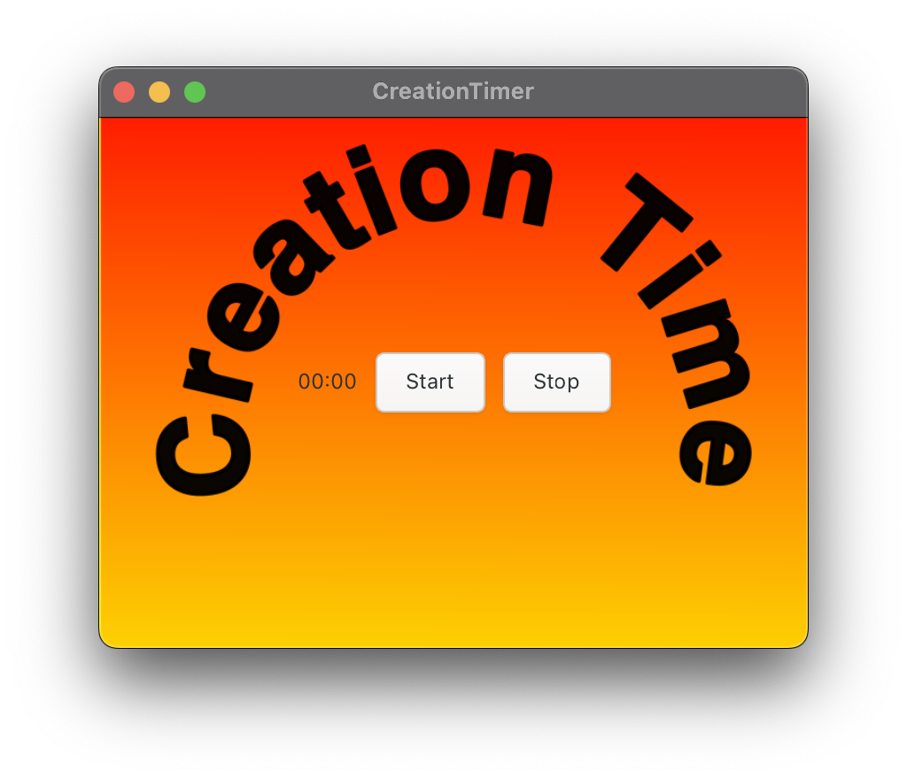

# Creation-timer-app
Creating a timer application as incentive for me to create more(meta application). The idea here it was born to be a Timer app that I can
start with keyboard shortcut and as soon as button start is clicked it starts counting time and when I press stop it should save this data somewhere in the Cloud, that later I might plot something with this data. All these just to make me code more in C.

# Inspiration 
It's been a while I wanted to go back to programming in C again and I felt like my skills were getting rusty. Also I felt inspired to create
more after reaing MJ De Marco book about how we need to create more
if we want to leave Consumer wagon for good.

# How to develop or edit it
1. You need to have GTK installed
2. Clone the repository
3. `make bundle`
4. `make`

And you should have everything you need to start editing.

# Results
This is how the app looks.

# Dream list
:white_large_square To add toolbar for sheet/env info change;
:white_large_square To have tags with binaries;
:white_large_square Compile it to Linux, Mac, Windows;
:white_large_square To have tags with binaries